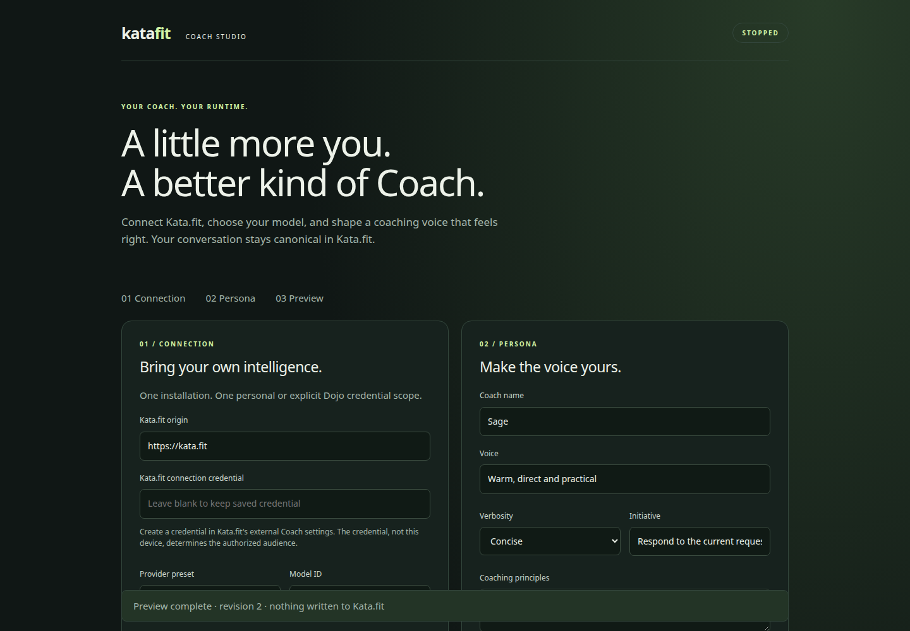

# Kata.fit Coach — standalone pilot

A local Node service with a browser studio for your Kata.fit connection, an explicit model provider, and a versioned coaching persona. No Hermes or OpenClaw dependency. One installation, one credential-authorized personal or Dojo scope. No shell/filesystem tools, proactive scheduler, mutations, or marketplace.

**Single-user Linux pilot, not production-certified.** Negotiated v2 adds request-scoped read tools and opt-in original-image input; v1 remains text-only. The v2 proof uses real Pi, MCP and disposable MongoDB with a synthetic provider/storage fixture, not live inference. Prior live text-only proof remains historical. No customer data or production credentials were used. See [request data access and proof](docs/request-data-access.md).

## Install from this repository

Requires Linux or macOS and **Node 22.19+**. Linux is the tested platform. Windows permissions/service management are not supported by this pilot.

```sh
git clone https://github.com/stevefortier/katafit-coach.git
cd katafit-coach
git checkout <reviewed-commit>
npm ci --ignore-scripts
npm test
npm run build
npm pack
npm install -g ./katafit-coach-0.1.0.tgz
katafit-coach start
katafit-coach open
```

The package is not published on npm; use the produced tarball from the reviewed commit. `start` starts the studio in the background, **not inference**. `open` launches your local browser with a fragment-only admin credential, immediately removed from browser history by the page. It is not written to logs or sent in the URL to the server. Credentials are now encrypted: the old headless workflow of reading `admin` directly from `secrets.json` no longer works. Use a local desktop with `open`; programmatic headless integrations must load the protected `Store` API and keep credentials in memory. Never expose or reverse-proxy the studio publicly.

1. Create a connection credential in Kata.fit's external Coach settings for the intended identity/scope. Paste it in the studio. No MCP configuration is exposed to users.
2. Select OpenAI API or a compatible custom endpoint, enter the **exact model ID and provider API key**, then save. No silent provider fallback; no account/subscription OAuth support. The current Pi OpenAI transport requires an API key. Unauthenticated LM Studio is not supported yet; do not invent a dummy key.
3. Test the saved Kata.fit connection. This verifies credential acceptance, **not inference or a persisted reply**.
4. Edit name, voice, principles, examples, boundaries, verbosity, initiative, or advanced Markdown. Save and preview; unsaved edits must be saved or reverted first. Preview calls the saved provider with the same system-instruction assembly as the worker, including freshly fetched backend instructions. If those instructions are unavailable/invalid, preview fails without inference. It never writes to Kata.fit and uses your sample question rather than canonical request context. The displayed instructions are a snapshot, not a guarantee about future backend changes. Rollback creates a new nonsecret configuration revision and preserves credentials.
5. Click **Run Coach**, then ask a text question in Kata.fit. The worker claims it, reads server-authorized context, infers, publishes, then reads the request's completed state back. Ask a follow-up to exercise canonical history. Inspect the reply in Kata.fit for end-to-end acceptance.

Stop the worker **before** changing connection/provider/persona. Blank password fields retain saved values; secrets are never returned to the UI. To revoke credentials, revoke at the provider/Kata.fit and replace them while stopped.

Credential replacement is rejected if its value occurs in the new, current or previous configuration. Remove the value and save clean configuration twice before retrying replacement, so neither retained revision contains it. Unsafe legacy storage also fails closed on load/rollback/export; stop the service and repair the protected local configuration rather than exporting it. Never paste real credentials into persona fields.

Clear-generation/anchor completion fencing remains backend-owned. v2 reads require explicit credential scopes and requester grants; a persona cannot grant access. Enable original-image input only for a known vision-capable provider. Preview has no claimed-request authority and exposes no data tools. Renewable leases remain unsupported. See the v2 contract and limitations below; earlier text-only receipts do not certify this expansion or its deployment.

## Operations

```sh
katafit-coach status  # authenticated health, no conversation or credentials
katafit-coach run     # enable request worker
katafit-coach pause   # cancel worker; keep studio open
katafit-coach stop    # cancel work and stop studio
katafit-coach serve   # foreground, suitable for a service supervisor
```

Default studio: `http://127.0.0.1:4317`. Data: `~/.katafit-coach` (directory 0700, files 0600). `KATAFIT_COACH_HOME` and `KATAFIT_COACH_PORT` override these. A lock prevents duplicate service ownership of the same installation. Start does not install a login/boot service, and workers intentionally start stopped after a service restart. A laptop asleep/offline means an offline Coach. The backend owns retries and request deadlines.

Local runtime does **not** mean local inference. Server-authorized context and opt-in original images go to your configured provider. Credentials use AES-256-GCM in `secrets.json` with a separate 0600 `secrets.key`; legacy plaintext storage migrates on load. This is not an OS keychain and does not protect against an attacker who can read both files or the running process. Back up both files together. Configuration rollback retains credentials; old binaries cannot read the new encrypted storage. Persona export omits secrets.

## Development and proof

```sh
npm ci --ignore-scripts
npm test
npm run build
npm run format:check
npm run test:package
npm run test:browser   # requires /usr/bin/google-chrome, or CHROME_PATH
```

Tests exercise real Node HTTP, the actual embedded Pi agent, request fencing, canonical follow-up, ambiguous publication, cancellation and transport cleanup, authenticated origin-checked admin APIs, configuration revision/rollback, and actual CLI lifecycle. Browser proof uses actual UI + Pi + a **synthetic streaming provider**, not a pretend live model.

- [Pi spike and adapter decision](docs/pi-spike.md)
- [Architecture and security](docs/architecture.md)
- [Wire protocol and app changes needed](docs/protocol.md)
- [Verification and limitations](docs/verification.md)


